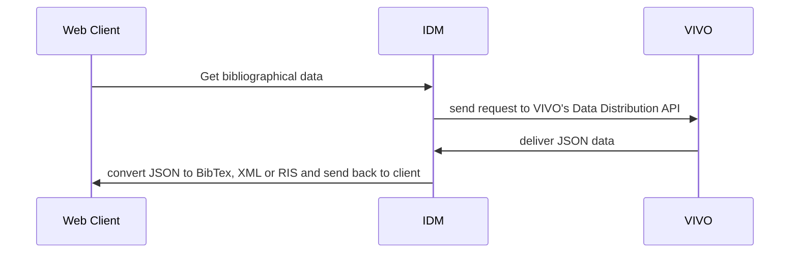

### Overview



## The definition of the Data Distribution API endpoint

```sql
:data_distributor_publications_by_author
    a   <java:edu.cornell.library.scholars.webapp.controller.api.distribute.DataDistributor> ,
        <java:edu.cornell.library.scholars.webapp.controller.api.distribute.rdf.SelectFromContentDistributor> ;
    :actionName "publications_by_author" ;
    :query """
PREFIX rdf:      <http://www.w3.org/1999/02/22-rdf-syntax-ns#>
PREFIX rdfs:     <http://www.w3.org/2000/01/rdf-schema#>
PREFIX xsd:      <http://www.w3.org/2001/XMLSchema#>
PREFIX foaf:     <http://xmlns.com/foaf/0.1/>
PREFIX hsmw:     <https://vivo.hs-mittweida.de/vivo/ontology/hsmw#>
PREFIX kdsf:     <http://kerndatensatz-forschung.de/owl/Basis#>
PREFIX vivo:     <http://vivoweb.org/ontology/core#>
PREFIX obo:      <http://purl.obolibrary.org/obo/>
PREFIX bibo:    <http://purl.org/ontology/bibo/>
PREFIX vivo-de: <http://vivoweb.org/ontology/core/de#>

                SELECT  DISTINCT
                        ?uri
                        ?type
						(SAMPLE(?pYear) AS ?publicationYear)
						(GROUP_CONCAT(DISTINCT ?aName; separator = "; ") AS ?authorName)
						(SAMPLE(?pubtitle) AS ?label)
						(SAMPLE(?pubIn) AS ?publishedIn)
						(SAMPLE(?biboVolume) AS ?volume)
						(SAMPLE(?biboIssue) AS ?issue)
						(SAMPLE(?biboEdition) AS ?edition)
						(SAMPLE(?pageStart) AS ?uritartPage)
						(SAMPLE(?pageEnd) AS ?endPage)
						(SAMPLE(?_publisher) AS ?publisher)
						(GROUP_CONCAT(DISTINCT ?_editor; separator = "; ") AS ?editor)
						(SAMPLE(?_doi) AS ?doi)
						(SAMPLE(?_issn) AS ?issn)
						(SAMPLE(?_isbn10) AS ?isbn10)
						(SAMPLE(?_isbn13) AS ?isbn13)
						WHERE
                        {
                                ?uri a bibo:Document .
								?uri <http://vitro.mannlib.cornell.edu/ns/vitro/0.7#mostSpecificType> ?type . 
                                ?uri rdfs:label ?pubtitle .
                                OPTIONAL {
                                        ?uri vivo:dateTimeValue ?dtv .
                                        ?dtv vivo:dateTime ?dt .
                                        BIND(xsd:dateTime(?dt) AS ?date)
                                        BIND(year(?date) AS ?pYear)
                                }
  							    OPTIONAL {
  									?uri bibo:pageStart ?pageStart . 
  								}
								OPTIONAL {
  									?uri bibo:pageEnd ?pageEnd . 
  								}
								OPTIONAL {
  									?uri bibo:volume ?biboVolume . 
  								}
  								OPTIONAL {
  									?uri bibo:issue ?biboIssue . 
  								}
								OPTIONAL {
  									?uri bibo:edition ?biboEdition . 
  								}
  								OPTIONAL {
    									?uri vivo:hasPublicationVenue ?pubvenue .
    									?pubvenue rdfs:label ?pubIn .
  										OPTIONAL {
      										?pubvenue vivo:publisher ?_pv_publishernode .
      										?_pv_publishernode a foaf:Organization .
      										?_pv_publishernode rdfs:label ?_pv_publisher .
    									}
										OPTIONAL {
      										?pubvenue vivo:relatedBy ?_pv_editorrole_node .
      										?_pv_editorrole_node a vivo:Editorship .
      										OPTIONAL {
        											?_pv_editorrole_node vivo:relates ?_pv_editornode .
      												?_pv_editornode a foaf:Person .
      												?_pv_editornode rdfs:label ?_pv_editor .
      										}
      									    OPTIONAL {
        											?_pv_editorrole_node vivo:relates ?_pv_editornode .
      												?_pv_editornode a foaf:Organization .
      												?_pv_editornode rdfs:label ?_pv_editor .
      										}
    									}
    									OPTIONAL {
      										?pubvenue bibo:isbn10 ?_pv_isbn10 .
    									}
    									OPTIONAL {
      										?pubvenue bibo:isbn13 ?_pv_isbn13 .
    									}
        								OPTIONAL {
      										?pubvenue bibo:issn ?_pv_issn .
    									}
  								}
    							OPTIONAL {
      										?uri vivo:publisher ?_doc_publishernode .
      										?_doc_publishernode a foaf:Organization .
      										?_doc_publishernode rdfs:label ?_doc_publisher .
    							}
  								OPTIONAL {
      										?uri vivo:relatedBy ?_doc_editorrole_node .
      										?_doc_editorrole_node a vivo:Editorship .
      								OPTIONAL {
    											?_doc_editorrole_node vivo:relates ?_doc_editornode .
    											?_doc_editornode a foaf:Person .
      											?_doc_editornode rdfs:label ?_doc_editor .
    								}
          							OPTIONAL {
    											?_doc_editorrole_node vivo:relates ?_doc_editornode .
    											?_doc_editornode a foaf:Organization .
      											?_doc_editornode rdfs:label ?_doc_editor .
    								}
  								}

  								OPTIONAL {
    									?uri bibo:doi ?_doi .
  								}
  							  OPTIONAL {
      										?uri bibo:isbn10 ?_doc_isbn10 .
    						  }
    						 OPTIONAL {
      										?uri bibo:isbn13 ?_doc_isbn13 .
    						 }
        					 OPTIONAL {
      										?uri bibo:issn ?_doc_issn .
    							}
                                ?uri vivo:relatedBy ?authorship .
  								?authorship a vivo:Authorship .
                                ?authorship vivo:relates  ?theAuthor .
  								BIND (COALESCE(?_pv_publisher, ?_doc_publisher) AS ?_publisher)
  								BIND (COALESCE(?_pv_editor, ?_doc_editor) AS ?_editor)
  								BIND (COALESCE(?_pv_issn, ?_doc_issn) AS ?_issn)
    							BIND (COALESCE(?_pv_isbn10, ?_doc_ibsn10) AS ?_isbn10)
    							BIND (COALESCE(?_pv_isbn13, ?_doc_isbn13) AS ?_isbn13)
  								OPTIONAL {
      									?uri vivo:relatedBy ?aship.
      									?aship a vivo:Authorship .
      									OPTIONAL {
    										?aship vivo:relates ?auth .
      										?auth a foaf:Person .
      										?auth rdfs:label ?aName .
    									 }
    									OPTIONAL {
      										?aship vivo:relates ?auth .
    										?auth a <http://www.w3.org/2006/vcard/ns#Individual> .
      										?auth <http://www.w3.org/2006/vcard/ns#hasName> ?vcardname .
      										?vcardname <http://www.w3.org/2006/vcard/ns#givenName> ?firstname .
          									?vcardname <http://www.w3.org/2006/vcard/ns#familyName> ?familyname .
      										BIND(CONCAT(?familyname, ", ", ?firstname) AS ?aName)
    									}
  								}
							} GROUP BY ?uri ?type
                        ORDER BY DESC(?publicationYear)
        """;
        :uriBinding "theAuthor" .
```

## The code that does the work

* inside a RoR application
* at the moment inside a specific controller (VivoController) as part of the IDM's REST API
* natively generates BibTex from deliverd JSON
* requires the small package *bib-utils* for converting from BibTex to XML or RIS

```
    def export_publications
        base_url = 'https://vivo.hs-mittweida.de/vivo/api/dataRequest/'

        # publication base
        action = 'publications_by_author'
        
        # the uri of the author
        authorUri = params[:uri]
        filename = params[:name].gsub(/ /, '')

        # type mappings VIVO -> BibTex
        type_mappings =  {
                "http://kerndatensatz-forschung.de/version1.2/technisches_datenmodell/owl/Basis#ArbeitspapierForschungsbericht" => "techreport",
                "http://kerndatensatz-forschung.de/version1.2/technisches_datenmodell/owl/Basis#BeitragInWissenschaftlichenBlogs" => "misc",
                "http://kerndatensatz-forschung.de/version1.2/technisches_datenmodell/owl/Basis#BeitraegeInterviewsInNicht-wissenschaftlichenMedien" => "misc",
                "http://kerndatensatz-forschung.de/version1.2/technisches_datenmodell/owl/Basis#Bibliographie" => "book",
                "http://kerndatensatz-forschung.de/version1.2/technisches_datenmodell/owl/Basis#Editorial" => "inbook",
                "http://kerndatensatz-forschung.de/version1.2/technisches_datenmodell/owl/Basis#Forschungsdaten" => "misc",
                "http://kerndatensatz-forschung.de/version1.2/technisches_datenmodell/owl/Basis#Dissertation" => "phdthesis",
                "http://kerndatensatz-forschung.de/version1.2/technisches_datenmodell/owl/Basis#Journalartikel" => "incollection",
                "http://kerndatensatz-forschung.de/version1.2/technisches_datenmodell/owl/Basis#Konferenzpaper" => "conference",
                "http://kerndatensatz-forschung.de/version1.2/technisches_datenmodell/owl/Basis#Konferenzposter" => "conference",
                "http://kerndatensatz-forschung.de/version1.2/technisches_datenmodell/owl/Basis#LetterToTheEditor" => "misc",
                "http://kerndatensatz-forschung.de/version1.2/technisches_datenmodell/owl/Basis#MeetingAbstract" => "misc",
                "http://kerndatensatz-forschung.de/version1.2/technisches_datenmodell/owl/Basis#Monographie" => "book",
                "http://kerndatensatz-forschung.de/version1.2/technisches_datenmodell/owl/Basis#Preprint" => "unpublished",
                "http://kerndatensatz-forschung.de/version1.2/technisches_datenmodell/owl/Basis#Quellenedition" => "misc",
                "http://kerndatensatz-forschung.de/version1.2/technisches_datenmodell/owl/Basis#Review" => "misc",
                "http://kerndatensatz-forschung.de/version1.2/technisches_datenmodell/owl/Basis#Rezension" => "misc",
                "http://kerndatensatz-forschung.de/version1.2/technisches_datenmodell/owl/Basis#Sammelbandbeitrag" => "incollection",
                "http://kerndatensatz-forschung.de/version1.2/technisches_datenmodell/owl/Basis#Software" => "misc",
                "http://kerndatensatz-forschung.de/version1.2/technisches_datenmodell/owl/Basis#WissenschaftlicheVortragsfolien" => "inproceedings"
        }
        
        # mappings attribute VIVO -> BibTex
        attribute_mappings = {
            "publicationYear" => "year",
#            "authorName" => "author",
            "label" => "title" ,
            "publishedIn" => "booktitle",
            "volume" => "volume",
            "issue" => "number",
            "edition" => "edition",
            "publisher" => "publisher",
            "editor" => "editor",
            "doi" => "doi",
            "issn" => "issn",
            "isbn10" => "isbn",
            "isbn13" => "isbn"
        }
        
        # get the id card picture of a user
        response = RestClient::Request.execute method: 'GET', url: base_url + action + "?theAuthor=" + authorUri
        response = JSON::parse(response)
        
        @contents = ""
        if response["results"] && response["results"]["bindings"] then
            
            response["results"]["bindings"].each do |publication|
        
                if type_mappings.has_key?(publication["type"]["value"]) then
                    
                    document_type = type_mappings[publication["type"]["value"]]
        
                    citation = 'VIVOHSMW-' + publication["uri"]["value"].split(/\//).pop.upcase
                
                    @contents += "@" + document_type + "{" + citation + ",\n"

                    @contents += "\tauthor = \"" + publication["authorName"]["value"].gsub(/; /, ' and ') + "\",\n"

                    attribute_mappings.each do |k, v|
        
                        if publication.has_key?(k) then
                            @contents += "\t" + v + " = \"" + publication[k]["value"] + "\",\n" 
                        end
        
                    end
                    
                    if publication["startPage"] && publication["endPage"] then
                        @contents += "\tpages = \"" + publication["startPage"]["value"] + " - " + publication["endPage"]["value"] + "\",\n"
                    end
        
                    @contents += "}\n\n"
                end
            end
            
	    if @contents != "" then
                bibfile = Tempfile.new('bibfile')
                modsfile = Tempfile.new('modsfile')
                xmlfile = Tempfile.new('xmfile')
                risfile = Tempfile.new('risfile')
                bib2mods = '/usr/bin/bib2xml ' + bibfile.path + ' >' + modsfile.path
                mod2xml = '/usr/bin/xml2wordbib ' + modsfile.path + ' >' + xmlfile.path
                mod2ris = '/usr/bin/xml2ris ' + modsfile.path + ' >' + risfile.path
                bibfile.puts(@contents)
                bibfile.close
                system(bib2mods)
                if params[:format] && params[:format] == 'word'
                    fname = filename + ".xml"
                    system(mod2xml)
                    @contents = xmlfile.open.read
                elsif params[:format] && params[:format] == 'ris'
                    fname = filename + ".ris"
                    system(mod2ris)
                    @contents = risfile.open.read
                else
                    fname = filename + ".bib"
                end
            end
        end
    
        if params[:file] then
            send_data @contents, filename: fname and return
        end
    
    end
```
## Freemarker Template thingies

In *individual--foaf-person.ftl*

```html
                                                     <form action="https://ndbapi.hs-mittweida.de/v1/vivo/export_publications" style="display: inline-block;">
                                                                <input type="hidden" name="uri" value="${individual.uri}">
                                                                <input type="hidden" name="name" value="${individual.name}">
                                                                <input type="hidden" name="format" value="word">
                                                                <input type="hidden" name="file" value="1">
                                                                <input type="submit" class="submit" value="Word XML" />
                                                        </form>
                                                        <form action="https://ndbapi.hs-mittweida.de/v1/vivo/export_publications" style="display: inline-block;">
                                                                <input type="hidden" name="uri" value="${individual.uri}">
                                                                <input type="hidden" name="name" value="${individual.name}">
                                                                <input type="hidden" name="file" value="1">
                                                                <input type="submit" class="submit" value="BibTeX" />
                                                        </form>
                                                        <form action="https://ndbapi.hs-mittweida.de/v1/vivo/export_publications" style="display: inline-block;">
                                                                <input type="hidden" name="uri" value="${individual.uri}">
                                                                <input type="hidden" name="name" value="${individual.name}">
                                                                <input type="hidden" name="format" value="ris">
                                                                <input type="hidden" name="file" value="1">
                                                                <input type="submit" class="submit" value="RIS" />
                                                        </form>
                                                        <span class="hsmw-help-smaller" style="padding-left: 0px; margin-top: 8px; margin-left: 12px; height: 24px;"><a href="https://vivo.hs-mittweida.de/tutorials/20-export-eigener-publikationslisten/" class="hsmw-help" style="font-size: 16px;" onclick="window.open(this.href, 'Hilfe Export Publikationslisten', 'width=600,height=400,left=1100,top=300'); return false" title="Hilfe zum Export der Publikationslisten">?</a></span>
```
