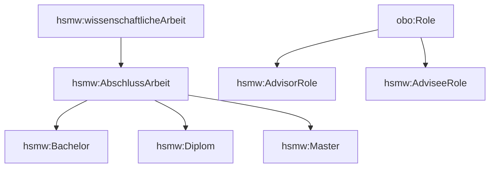
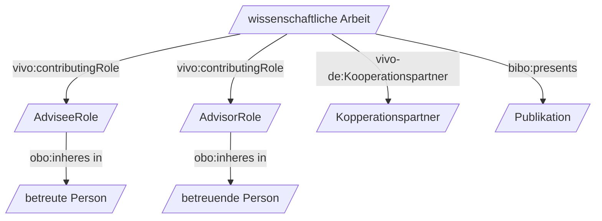

# Mentoring Model

## Classes

```mermaid
flowchart TD
    A[hsmw:wissenschaftlicheArbeit]
    B[hsmw:AbschlussArbeit]
    C[hsmw:Bachelor]
    D[hsmw:Diplom]
    E[hsmw:Master]
    F[obo:Role]
    G[hsmw:AdvisorRole]
    H[hsmw:AdviseeRole]

    A-->B
    B-->C
    B-->D
    B-->E

    F-->G
    F-->H
```

## Relations

```mermaid
flowchart TD
    A[/wissenschaftliche Arbeit/]
    B[/AdviseeRole/]
    C[/AdvisorRole/]
    D[/betreuende Person/]
    E[/betreute Person/]
    F[/Kopperationspartner/]
    G[/Publikation/]

    A-- vivo:contributingRole -->B
    A-- vivo:contributingRole -->C
    A-- vivo-de:Kooperationspartner -->F
    A-- bibo:presents -->G
    B-- obo:inheres in -->E
    C-- obo:inheres in -->D
```
