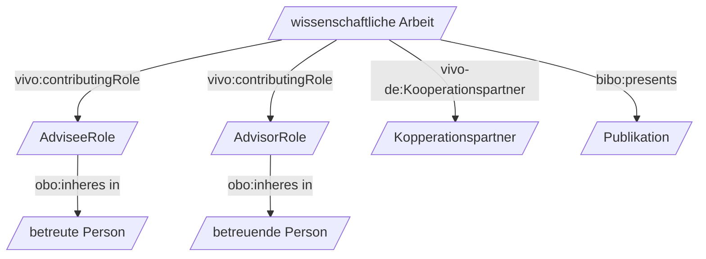

# Mentoring Model

## Relations

```mermaid
flowchart TD
    A[/wissenschaftliche Arbeit/]
    B[/AdviseeRole/]
    C[/AdvisorRole/]
    D[/betreuende Person/]
    E[/betreute Person/]
    F[/Kopperationspartner/]
    G[/Publikation/]

    A-- vivo:contributingRole -->B
    A-- vivo:contributingRole -->C
    A-- vivo-de:Kooperationspartner -->F
    A-- bibo:presents -->G
    B-- obo:inheres in -->E
    C-- obo:inheres in -->D
```
