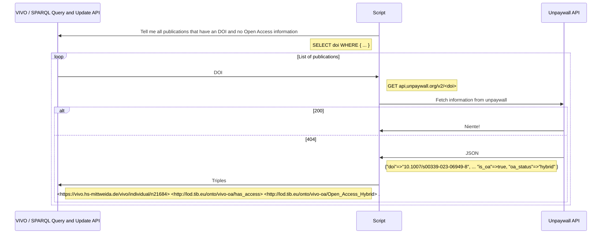

Example script for querying unpaywall API:

```ruby
# !/usr/bin/env ruby

libdir = "#{__dir__}/lib"
localedir = "#{libdir}/locale"
$LOAD_PATH.push(libdir)

require 'rest_client'
require 'json'
require 'vivo'
require "#{__dir__}/.config.rb"

vivo = VIVO.new(VIVOURL, VIVOUSER, VIVOPASS)

q = 'SELECT ?uri ?title ?doi WHERE { ?uri a bibo:Document . ?uri rdfs:label ?title . ?uri  bibo:doi ?doi .}'
publications = vivo.query(q)

publications.each do |pub|
    doi = pub['doi']
    uri = pub['uri']
    title = pub['title']
    response = RestClient::Request.execute method: 'GET', url: "https://api.unpaywall.org/v2/#{doi}?email=vivo@hs-mittweida.de"
    data = JSON::parse(response.body)
    if data['is_oa'] && data['is_oa'] == true
        puts "OA State of \"#{title}\" is #{data['oa_status']}"
        # TODO: put open access state back to VIVO
    else
        puts "\"#{title}\" is not OA."
    end
end
```

Example output:

```shell
"Mehr Selbständigkeit, aber auch mehr Risiko – Die Position der Menschen mit Behinderung im Bundesteilhabegesetz am Beispielfeld Wohnen" is not OA.
"Manufacturing of high quality 3D microstructures in stainless steel with ultrashort laser pulses using different burst modes" is not OA.
"Improvement of speech recognition results by a combination of systems" is not OA.
"Drilling of Glass by Excimer Laser Mask Projection Technique" is not OA.
OA State of "Lose Zugehörigkeiten und schwindende Bindungen" is bronze
"Ultrafast Pump and Probe Investigations on the Interaction of Femtosecond Laser Pulses with Glass" is not OA.
"Selective rear-side ablation of aluminum thin layers with ultrashort-pulsed laser radiation" is not OA.
OA State of "Software support for SBGN maps: SBGN-ML and LibSBGN" is hybrid
OA State of "Bounding the gap between the McCormick relaxation and the convex hull for bilinear functions" is green
"Dielectrically driven convection in spherical gap geometry" is not OA.
"Development of an iridium-based pH sensor for bioanalytical applications" is not OA.
OA State of "An analytical model for genetic hitchhiking in the evolution of antimalarial drug resistance" is green
"Process Plant Layout Optimization: Equipment Allocation" is not OA.
"P-65: Advanced Processing of ITO and IZO Thin Films on Flexible Glass" is not OA.
"UV laser radiation-induced modifications and microstructuring of glass" is not OA.
"Arbeitsformen und Erwerbstätigkeit" is not OA.
OA State of "Stick, Flick, Click: DNA-guided Fluorescent Labeling of Long RNA for Single-molecule FRET" is gold
```
